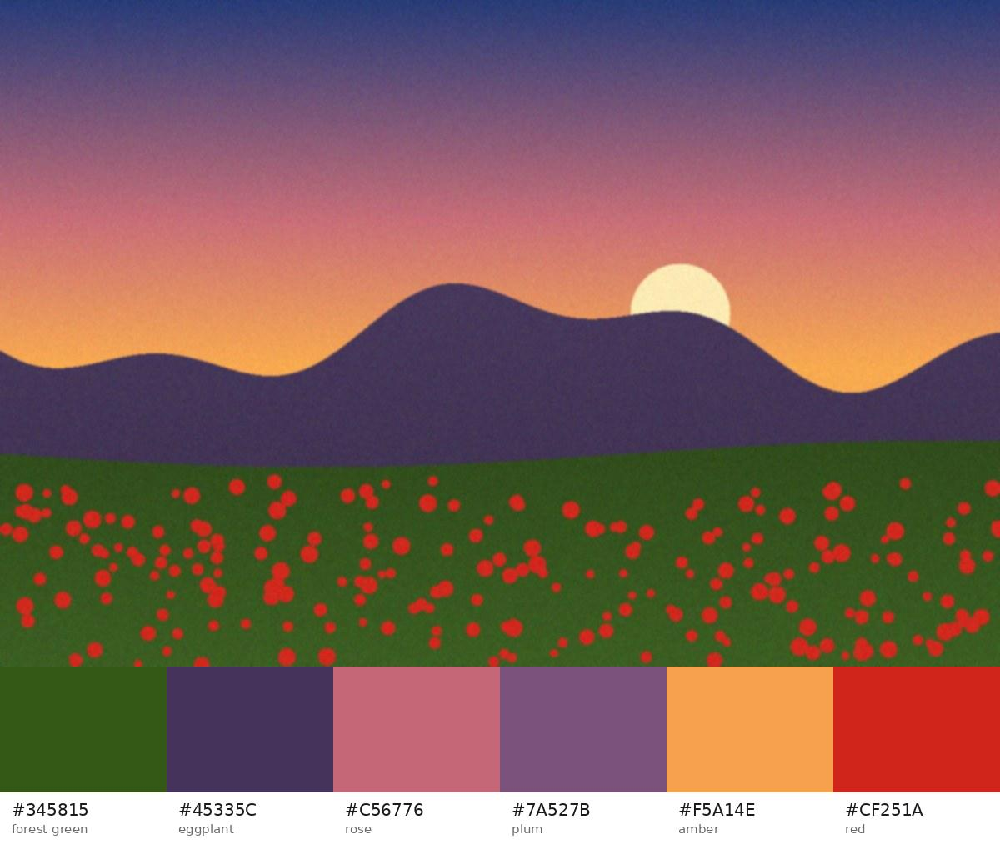

# Photo Palette: a Codex plugin

Turns photographs into clean, usable color palettes. Ask Codex for "the color
palette from `beach.jpg`" and you get named hex colors, UI roles
(background, surface, text, primary, accent) and ready-to-paste CSS,
SCSS, Tailwind, JSON, SVG or GIMP/Inkscape/Krita palettes.



## What's in the plugin

| Part | Path | What it does |
| --- | --- | --- |
| Skill | `skills/photo-palette/SKILL.md` | Tells Codex when and how to build a palette and how to present or apply it. |
| Extractor | `skills/photo-palette/scripts/palette.py` | The palette engine, also usable as a standalone CLI. |
| MCP server | `mcp/server.py` (wired up in `.mcp.json`) | Exposes an `extract_palette` tool to Codex. It has no extra dependencies. |
| Manifest | `.codex-plugin/plugin.json` | Plugin metadata, and pointers to the skill and the MCP server. |

## Why the palettes look clean

Naive extractors (k-means in RGB, or median cut) often give muddy, near-duplicate
colors on real photos. This one fixes that in six ways:

1. **It works in a perceptual color space.** It clusters in OKLab, where
   distance matches how different two colors look.
2. **It ignores edge blends.** Pixels on edges mix two surfaces (a red petal
   on a green leaf blurs to brown), so they get less weight. It smooths the
   image slightly first, so sensor noise doesn't count as an edge.
3. **It avoids mud.** Each color is a trimmed mean of the cluster's core
   pixels. The saturation that averaging different hues removes is then put
   back.
4. **It keeps the colors that matter.** The picker weighs how much of the
   photo a color covers against how colorful it is, so a 3% red accent can
   beat a fifth shade of sky blue. Near-duplicates are penalized.
5. **It discounts camera artefacts.** Clipped highlights and crushed shadows
   count less.
6. **It finishes the colors.** You choose `clean`, `natural`, `vivid` or
   `muted`. Every color is gamut-mapped back to sRGB by reducing chroma, so
   hue and lightness stay put.

Each palette also comes with UI roles and WCAG contrast numbers. Photos rarely
contain a usable page background or body-text color. When a photo has none, the
plugin derives a quiet tint in the photo's dominant hue and labels that role as
derived.

## Install

The quickest way is to run `bash install.sh` from the repository root (or
from the unzipped folder). It installs Pillow and NumPy if they're missing and
works on any Codex version. The [root README](../../README.md) has the manual
steps, Windows notes and a troubleshooting table.

By hand, on Codex 0.135 or newer:

```bash
python3 -m pip install -r plugins/photo-palette/requirements.txt
codex plugin marketplace add /path/to/jj      # the repository root, not this folder
codex plugin add photo-palette@jj
```

From GitHub instead, while the plugin is on a branch:
`codex plugin marketplace add jqiu6-spec/jj --ref claude/quirky-thompson-7o7tvm`.

Restart Codex afterwards so it loads the skill and the MCP server.

## Use it in Codex

```
Generate a clean color palette from ~/Pictures/kyoto.jpg
Give me 8 vivid colors from hero.jpg as Tailwind theme variables
Build one muted moodboard palette from every image in ./refs and add it to src/styles/tokens.css
```

## Use the CLI directly

```bash
S=plugins/photo-palette/skills/photo-palette/scripts
python3 $S/palette.py photo.jpg                          # readable table
python3 $S/palette.py photo.jpg -n 8 -s vivid -f css     # CSS custom properties
python3 $S/palette.py photo.jpg -f tailwind --prefix brand -o theme.css
python3 $S/palette.py a.jpg b.jpg c.jpg --preview board.png   # one moodboard palette
python3 $S/palette.py photo.jpg -f json --no-neutrals --sort hue
```

| Option | Default | Choices |
| --- | --- | --- |
| `-n, --count` | 6 | 1–16 |
| `-s, --style` | `clean` | `clean`, `natural`, `vivid`, `muted` |
| `-f, --format` | `text` | `text`, `json`, `css`, `scss`, `tailwind`, `gpl`, `svg` |
| `--sort` | `weight` | `weight`, `lightness`, `hue` |
| `--no-neutrals` | off | skip grays, near-blacks and near-whites |
| `--prefix` | `palette` | variable prefix for css/scss/tailwind |
| `-o, --output` | stdout | write the formatted output to a file |
| `--preview` | – | save the photo with its swatch strip as an image |

Example JSON (trimmed):

```json
{
  "style": "clean",
  "colors": [
    {"hex": "#345815", "name": "forest green", "share": 0.273, "roles": ["primary"],
     "oklch": [0.418, 0.1033, 133.6], "contrast": {"white": 8.23, "black": 2.55}, "text_on": "#FFFFFF"}
  ],
  "roles": {"background": "#F5F8F3", "surface": "#E5ECE2", "text": "#45335C",
            "primary": "#345815", "accent": "#CF251A"},
  "derived_roles": ["background", "surface"]
}
```

The output is deterministic: the same image and options always give the same
palette.

## Development

```bash
cd plugins/photo-palette
python3 -m unittest discover -s tests -v
```

The tests cover color recovery, small-accent survival, edge-blend suppression,
transparency, 16-bit input, styles staying in gamut, role contrast, moodboards,
every output format, the CLI and the MCP JSON-RPC handshake.
